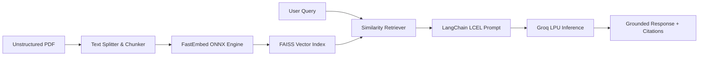

# DocuMind — Full-Stack RAG Document Intelligence System

A production-grade Retrieval-Augmented Generation (RAG) system built with **FastAPI**, **React 19**, **LangChain**, **FAISS**, and **Groq LPU Hardware Inference**.

[](https://vercel.com)
[](https://render.com)
[](https://clerk.com)
[](https://groq.com)
[](https://github.com/facebookresearch/faiss)

---

## Technical Overview

DocuMind is an end-to-end question-answering architecture designed to parse unstructured multi-page PDF documents, construct semantic vector indices, and synthesize factual answers with strict source attribution.

- **Document Processing**: Parses multi-page PDF documents using `pdfminer.six` and chunks text using `RecursiveCharacterTextSplitter`.
- **Dense Vector Search**: Generates ONNX-accelerated dense embeddings with `FastEmbed (BGE-Small)` and indexes passages using `FAISS CPU`.
- **LPU Acceleration**: Executes inference via Groq LPUs with sub-100ms response latency and strict zero-hallucination grounding.
- **Cryptographic Authentication**: Protects API routes with RS256 JWT validation against Clerk JWKS public certificates.
- **Modern User Interface**: Responsive workspace built with React 19, Vite, and clean enterprise UX.

---

## System Architecture



---

## Tech Stack

### Frontend
- **Core**: React 19, Vite
- **Auth**: `@clerk/clerk-react`
- **Icons & UI**: Lucide React, Enterprise Slate Design System
- **HTTP Client**: Axios

### Backend
- **Framework**: FastAPI (Python 3.11)
- **RAG Orchestration**: LangChain, LangChain-Groq, LangChain-Community
- **Embeddings**: FastEmbed (ONNX Runtime)
- **Vector Store**: FAISS (Facebook AI Similarity Search)
- **Token Verification**: Python-Jose / PyJWT (RS256 JWKS)

---

## Local Development

### Prerequisites
- Python 3.10+
- Node.js 18+
- Groq Cloud API Key
- Clerk Instance Credentials

### 1. Repository Setup
```bash
git clone https://github.com/Ajmal2507/AI_document_chatbot.git
cd AI_document_chatbot
```

### 2. Backend Configuration
```bash
cd backend
python -m venv venv

# Activate Environment
# Windows:
venv\Scripts\activate
# macOS / Linux:
source venv/bin/activate

# Install Dependencies
pip install -r requirements.txt
```

Create a `.env` file in `backend/`:
```env
GROQ_API_KEY=your_groq_api_key
CLERK_JWKS_URL=https://your-clerk-instance.clerk.accounts.dev/.well-known/jwks.json
```

Run the backend API:
```bash
uvicorn app:app --reload --port 8000
```

### 3. Frontend Configuration
In a separate terminal:
```bash
cd frontend
npm install
```

Create a `.env.local` file in `frontend/`:
```env
VITE_CLERK_PUBLISHABLE_KEY=pk_test_...
VITE_API_URL=http://127.0.0.1:8000
```

Run the development server:
```bash
npm run dev
```
