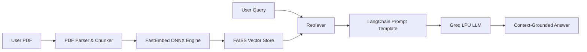

# 🤖 AI Document Chatbot (Full-Stack RAG System)

An intelligent, context-aware document question-answering assistant built with **Retrieval-Augmented Generation (RAG)**, **FastAPI**, **React 19**, **LangChain**, and high-speed **Groq LPU Inference**.

[](https://vercel.com)
[](https://render.com)
[](https://clerk.com)
[](https://groq.com)
[](https://github.com/facebookresearch/faiss)

---

## 🌟 Key Features

- 📄 **Dynamic PDF Processing**: Extracts and parses multi-page documents seamlessly with `pdfminer.six`.
- 🔍 **High-Speed Semantic Search**: Text chunking with `RecursiveCharacterTextSplitter` and lightweight vector embeddings with `FastEmbed (BGE-Small)`.
- ⚡ **Ultra-Fast LLM Inference**: Near-instant answers powered by Groq LPU engine and state-of-the-art open models.
- 🔒 **Secure Authentication**: End-to-end user authentication and JWT validation with Clerk.
- 🎨 **Modern Responsive UI**: Clean interface built with React 19, Vite, and Bootstrap.
- 💡 **Context Attribution**: Displays relevant source context snippets alongside generated answers.

---

## 🏗️ System Architecture



---

## 🛠️ Tech Stack

### Frontend:
- **Framework**: React 19 + Vite
- **Auth**: `@clerk/clerk-react`
- **HTTP Client**: Axios
- **Styling**: Modern CSS3 & Bootstrap

### Backend:
- **Framework**: FastAPI (Python 3.11)
- **RAG & Orchestration**: LangChain, LangChain-Groq, LangChain-Community
- **Embeddings**: FastEmbed (ONNX runtime for lightweight, fast embeddings)
- **Vector Search**: FAISS (Facebook AI Similarity Search)
- **Auth Verification**: PyJWT / Python-Jose (Clerk JWKS public key verification)

---

## 🚀 Getting Started Locally

### Prerequisites
- Python 3.10+
- Node.js 18+
- Groq Cloud API Key
- Clerk Application Keys

### 1. Clone the Repository
```bash
git clone https://github.com/Ajmal2507/AI_document_chatbot.git
cd AI_document_chatbot
```

### 2. Backend Setup
```bash
cd backend
python -m venv venv

# Activate Virtual Environment
# Windows:
venv\Scripts\activate
# macOS/Linux:
source venv/bin/activate

# Install dependencies
pip install -r requirements.txt
```

Create a `.env` file in `backend/`:
```env
GROQ_API_KEY=your_groq_api_key
CLERK_JWKS_URL=https://your-clerk-instance.clerk.accounts.dev/.well-known/jwks.json
```

Run the backend server:
```bash
uvicorn app:app --reload --port 8000
```

### 3. Frontend Setup
In a new terminal:
```bash
cd frontend
npm install
```

Create a `.env.local` file in `frontend/`:
```env
VITE_CLERK_PUBLISHABLE_KEY=pk_test_...
VITE_API_URL=http://127.0.0.1:8000
```

Run the development server:
```bash
npm run dev
```
